# Moving clang-tidy into a FeatureModule

A visual walkthrough of squashed commit [`a19cee127bed`](https://github.com/ArcsinX/llvm-project/commit/a19cee127beda88aa79dd0e7d18eb395a6eb4da7) (`Moved clang-tidy into feature module`), compared with its parent [`18f9e623e4c8`](https://github.com/ArcsinX/llvm-project/tree/18f9e623e4c891ba31ff817c07197707ac9bc593).

All source links point directly to the squashed commit. [View the complete change on GitHub](https://github.com/ArcsinX/llvm-project/commit/a19cee127beda88aa79dd0e7d18eb395a6eb4da7).

The main change is ownership: clang-tidy logic formerly embedded in `ParsedAST.cpp` and `Diagnostics.cpp` is owned by `ClangTidyFeatureModule` and its per-build `TidyASTListener`. The core still controls the frontend lifecycle.

Original explanatory comments and existing FIXMEs move together with the code. Their wording is retained; indentation and line wrapping may change. New comments explain the added adapters and wiring. [Figure 19](#19-code-moves-together-with-its-original-comments) shows paired examples.

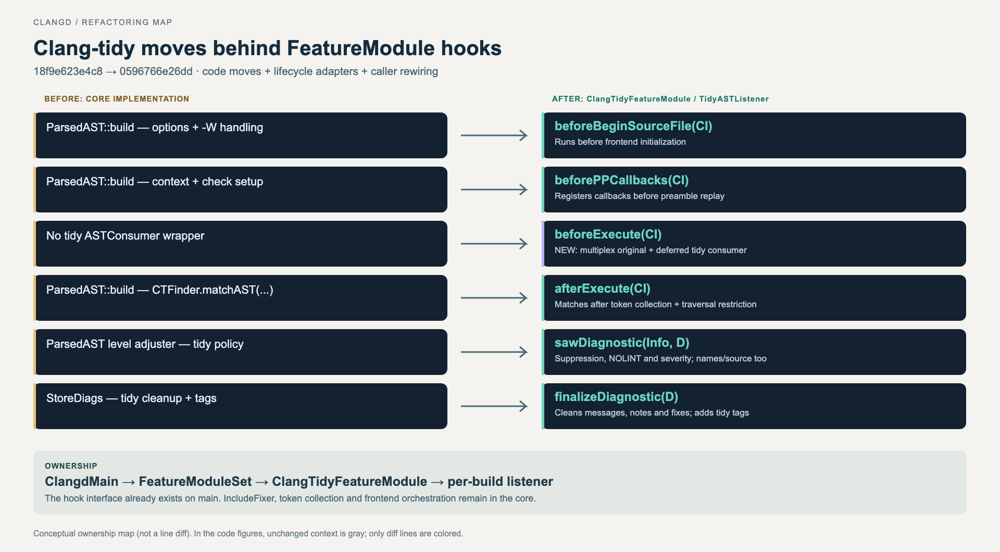

## Reading the diagrams

Amber (−) marks lines removed at the shown location; green (+) marks lines added there; gray marks unchanged context. Colors follow the actual git diff. A deletion/addition pair may be a rewrite or reindentation within the same core file. Arrows map the tidy responsibility described by the figure, not every line in its excerpts.

Each figure pairs **before** and **after** source excerpts with highlighted selections and an arrow. These are source-rendered images, not IDE screenshots. Lines are taken verbatim from the two git snapshots; line numbers are original, and gaps are marked. File paths in the images are relative to `clang-tools-extra/clangd/`.

- **Move / adapt:** relocated responsibility, with renaming or lifecycle adjustments.
- **New glue / ownership:** new code required to connect the module. It is not shown as a literal move.
- **Rewire / test adapter:** callers change how they supply the feature.
- **Stays in place:** code that may appear moved in the diff but remains in the core.

This is **not** a claim that the entire commit is a byte-for-byte move. In particular, it adds consumer wrappers, provider snapshots and filename normalization; it preserves the old no-check suppression policy, preserves module-provided metadata, and avoids duplicate tags.

Open [the hosted walkthrough](https://arcsinx.github.io/clang-tidy-feature-module-walkthrough/) for a self-contained, zoomable copy, or [the complete diff](migration.patch) for every changed line. PNGs are used below for Markdown compatibility; each section also links to a scalable SVG.

## Lifecycle map

| Existing lifecycle point | Module responsibility |
| --- | --- |
| Before `BeginSourceFile()` | Read options and apply compiler warning options |
| [`beforePPCallbacks()`](https://github.com/ArcsinX/llvm-project/blob/a19cee127beda88aa79dd0e7d18eb395a6eb4da7/clang-tools-extra/clangd/FeatureModule.h#L130) | Create context/checks; register callbacks and matchers |
| [`beforeExecute()`](https://github.com/ArcsinX/llvm-project/blob/a19cee127beda88aa79dd0e7d18eb395a6eb4da7/clang-tools-extra/clangd/FeatureModule.h#L135) | Install the multiplexer and deferred tidy consumer |
| [`afterExecute()`](https://github.com/ArcsinX/llvm-project/blob/a19cee127beda88aa79dd0e7d18eb395a6eb4da7/clang-tools-extra/clangd/FeatureModule.h#L140) | Run matching after tokens are collected and traversal is restricted |
| [`sawDiagnostic()`](https://github.com/ArcsinX/llvm-project/blob/a19cee127beda88aa79dd0e7d18eb395a6eb4da7/clang-tools-extra/clangd/FeatureModule.h#L147) | Apply tidy policy; identify tidy diagnostics |
| [`finalizeDiagnostic()`](https://github.com/ArcsinX/llvm-project/blob/a19cee127beda88aa79dd0e7d18eb395a6eb4da7/clang-tools-extra/clangd/FeatureModule.h#L151) | Clean messages and attach tidy-specific tags |

`Preamble.cpp` is unchanged. The lifecycle hooks are already in the parent; `FeatureModule.h` now clarifies that retained errors without source locations reach diagnostic listeners. Preamble listeners do not run tidy checks: `beforeBeginSourceFile()` is main-file-only, and the tidy listener skips initialization without those options.

## Core code retained by the migration

The following blocks stay in `ParsedAST.cpp`; their line numbers shift because tidy code above them was extracted.

| Retained block | Before | After |
| --- | --- | --- |
| Frontend startup and beforeBeginSourceFile dispatch | [L546](https://github.com/ArcsinX/llvm-project/blob/18f9e623e4c891ba31ff817c07197707ac9bc593/clang-tools-extra/clangd/ParsedAST.cpp#L546) | [L371](https://github.com/ArcsinX/llvm-project/blob/a19cee127beda88aa79dd0e7d18eb395a6eb4da7/clang-tools-extra/clangd/ParsedAST.cpp#L371) |
| beforeExecute dispatch and Execute() | [L756](https://github.com/ArcsinX/llvm-project/blob/18f9e623e4c891ba31ff817c07197707ac9bc593/clang-tools-extra/clangd/ParsedAST.cpp#L756) | [L490](https://github.com/ArcsinX/llvm-project/blob/a19cee127beda88aa79dd0e7d18eb395a6eb4da7/clang-tools-extra/clangd/ParsedAST.cpp#L490) |
| Token finalization and traversal restriction | [L770](https://github.com/ArcsinX/llvm-project/blob/18f9e623e4c891ba31ff817c07197707ac9bc593/clang-tools-extra/clangd/ParsedAST.cpp#L770) | [L504](https://github.com/ArcsinX/llvm-project/blob/a19cee127beda88aa79dd0e7d18eb395a6eb4da7/clang-tools-extra/clangd/ParsedAST.cpp#L504) |
| afterExecute dispatch | [L785](https://github.com/ArcsinX/llvm-project/blob/18f9e623e4c891ba31ff817c07197707ac9bc593/clang-tools-extra/clangd/ParsedAST.cpp#L785) | [L513](https://github.com/ArcsinX/llvm-project/blob/a19cee127beda88aa79dd0e7d18eb395a6eb4da7/clang-tools-extra/clangd/ParsedAST.cpp#L513) |

Only the tidy configuration, check setup, matching and diagnostic policy are extracted. Existing lifecycle dispatch, token collection and generic module forwarding remain in core code.

## Detailed before / after views

### 1. Configuration and compiler warning options

**MOVE + ADAPT.** Only tidy options and warning handling move into the listener; frontend startup stays in ParsedAST.

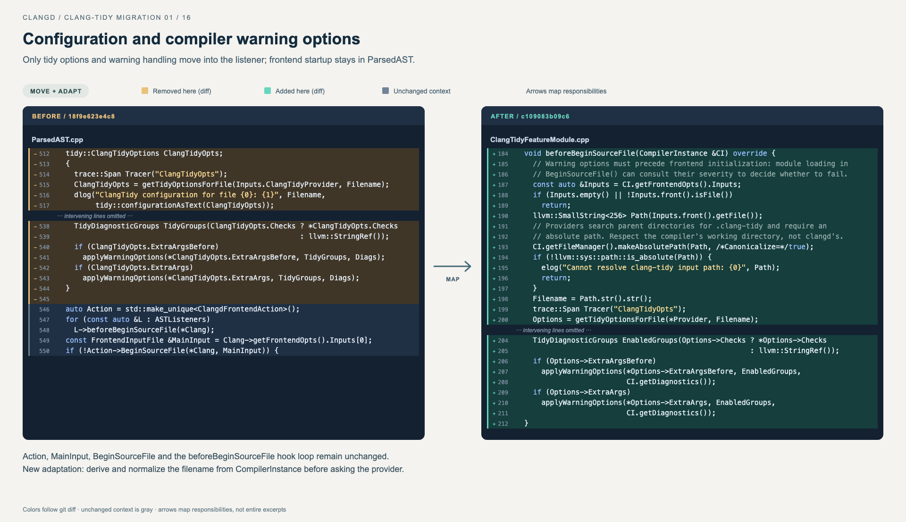

[Scalable image](assets/01-options.svg)

- Action, MainInput, BeginSourceFile and the beforeBeginSourceFile hook loop remain unchanged.
- New adaptation: preserve the requested filename from the remapped main-file buffer; normalize only relative fallback paths.

### 2. Tidy-specific helpers and linker dependencies

**MOVE + CLEANUP.** The warning-group parser, warning mapper, fast-check filter and force-linker leave ParsedAST.cpp and live with the module.

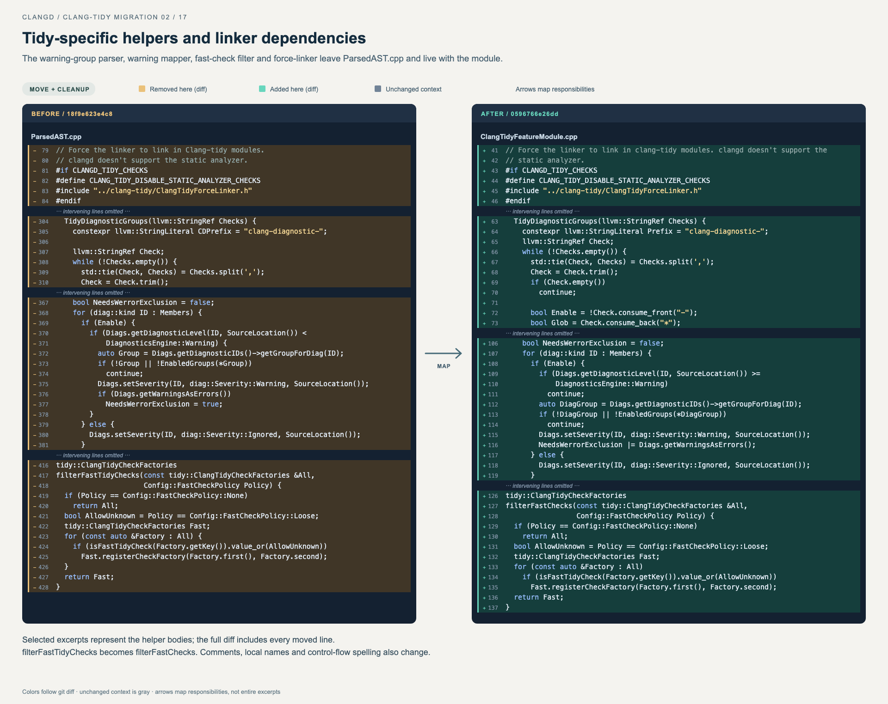

[Scalable image](assets/02-helpers.svg)

- Selected excerpts represent the helper bodies; the full diff includes every moved line.
- filterFastTidyChecks becomes filterFastChecks; original helper comments and FIXMEs move with the code.

### 3. Per-build state and ClangTidyContext

**MOVE + OWNERSHIP.** Stack-local tidy state in ParsedAST::build becomes the state of one TidyASTListener per main-file build.

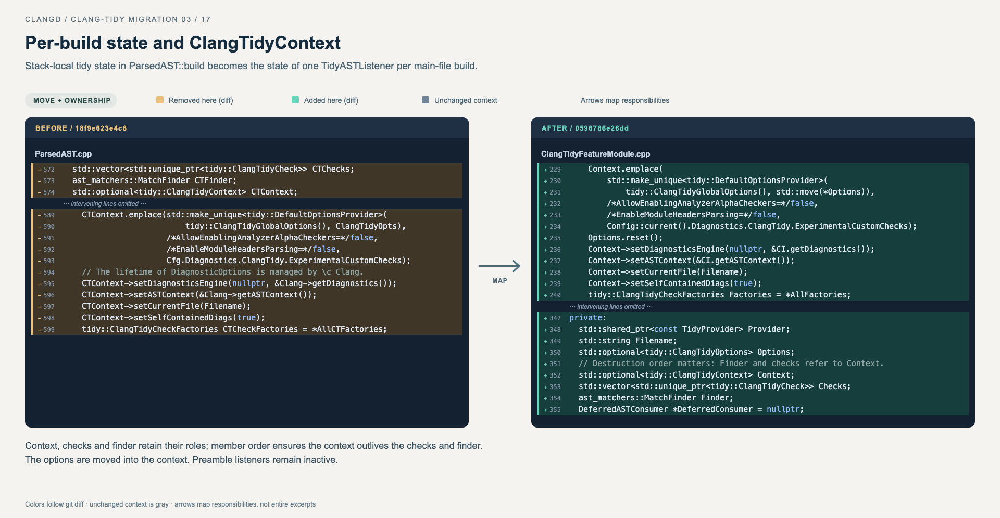

[Scalable image](assets/03-context.svg)

- Context, checks and finder retain their roles; member order ensures the context outlives the checks and finder.
- The options are moved into the context. Preamble listeners remain inactive.

### 4. Factories, custom checks and callback registration

**MOVE + ADAPT.** Check setup moves into beforePPCallbacks(), after BeginSourceFile and before clangd captures callbacks for preamble replay.

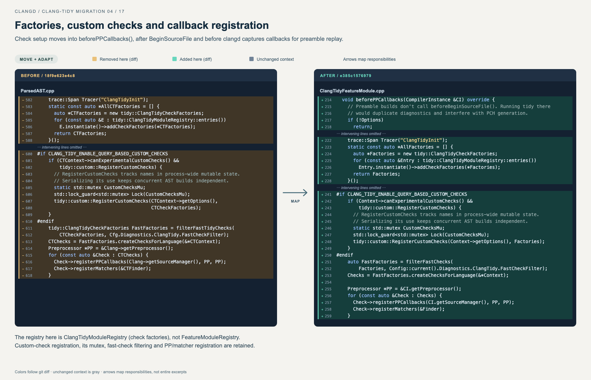

[Scalable image](assets/04-checks.svg)

- The registry here is ClangTidyModuleRegistry (check factories), not FeatureModuleRegistry.
- Custom-check registration, its mutex, fast-check filtering and PP/matcher registration are retained.

### 5. AST matching still runs after token collection

**MOVE + ADAPTER.** Direct tidy matching moves to the listener; the existing afterExecute dispatch reaches its deferred consumer.

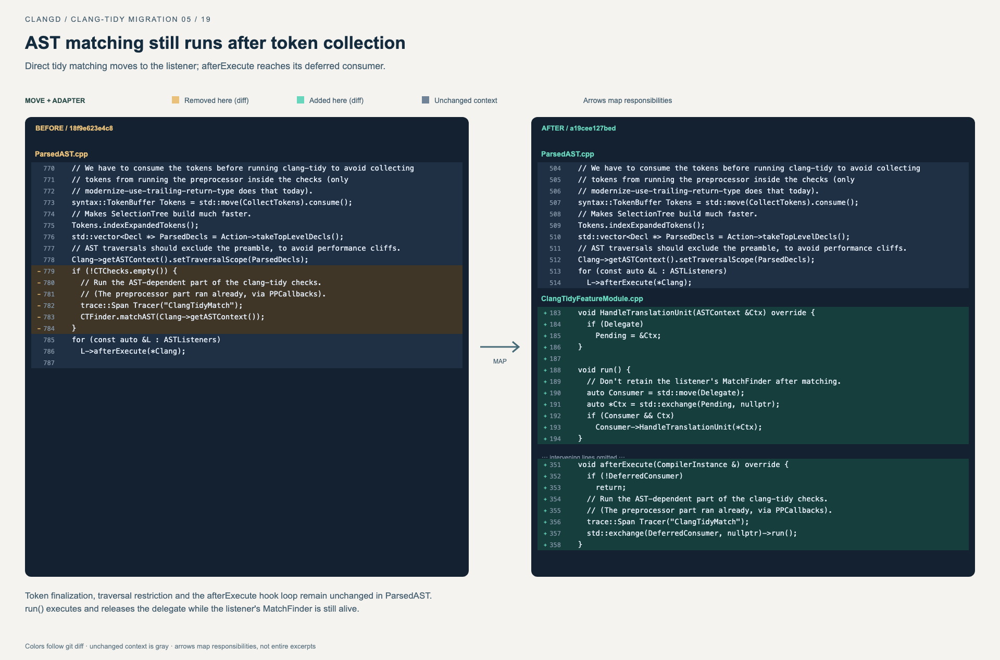

[Scalable image](assets/05-match.svg)

- Token finalization, traversal restriction and the afterExecute hook loop remain unchanged in ParsedAST.
- HandleTranslationUnit records the AST first; run() executes the delegate only after those steps.

### 6. MultiplexConsumer is new lifecycle glue

**NEW GLUE.** The new tidy listener uses the existing beforeExecute hook to add the original and deferred tidy consumers.

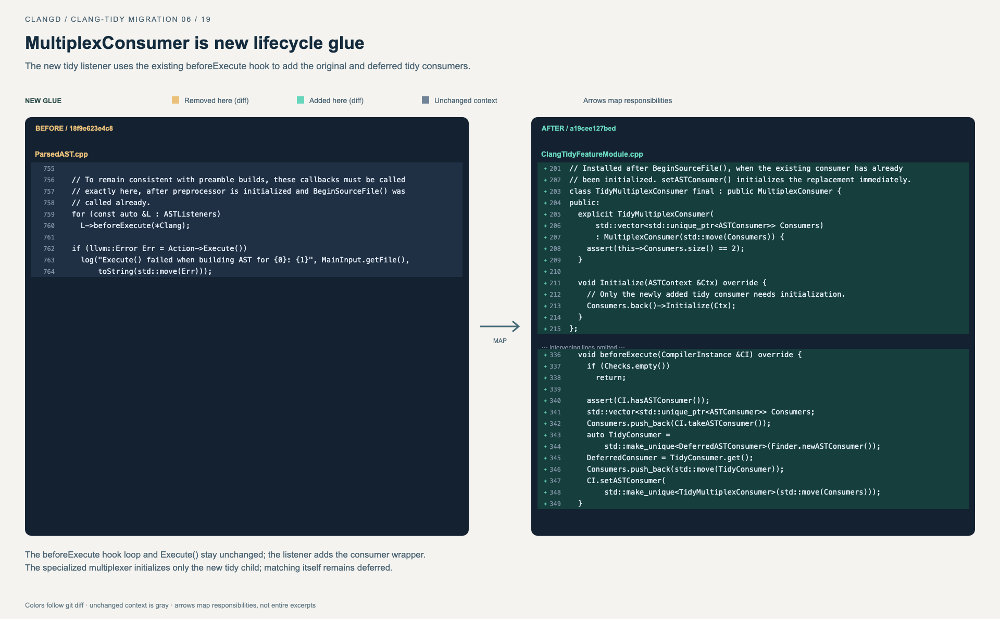

[Scalable image](assets/06-multiplex.svg)

- The beforeExecute hook loop and Execute() stay unchanged; the listener adds the consumer wrapper.
- The specialized multiplexer initializes only the new tidy child; matching itself remains deferred.

### 7. Diagnostic suppression and severity policy

**MOVE + BEHAVIOR DETAIL.** The tidy-specific part of ParsedAST's level adjuster moves to sawDiagnostic(). It edits the assembled diagnostic's severity.

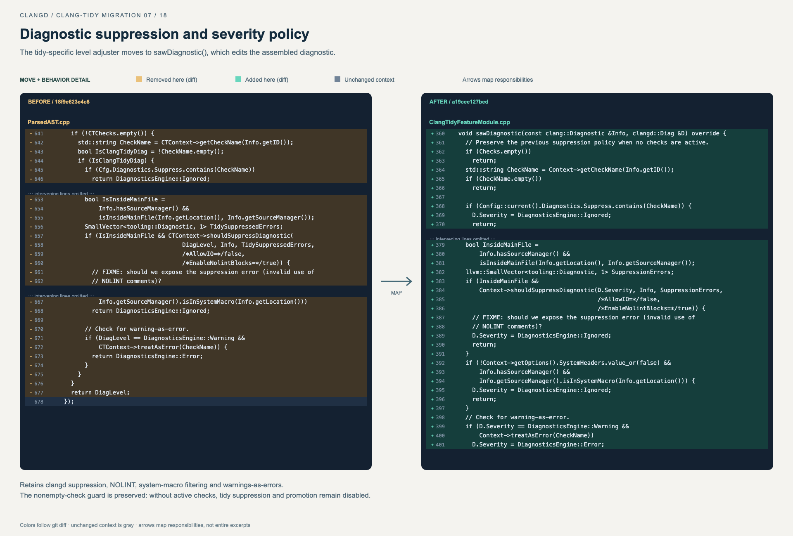

[Scalable image](assets/07-filtering.svg)

- Retains clangd suppression, NOLINT, system-macro filtering and warnings-as-errors.
- The nonempty-check guard is preserved: without active checks, tidy suppression and promotion remain disabled.

### 8. Diagnostic names and source move out of StoreDiags

**MOVE + GENERIC FALLBACK.** The listener identifies tidy diagnostics; StoreDiags no longer receives a ClangTidyContext and preserves supplied metadata.

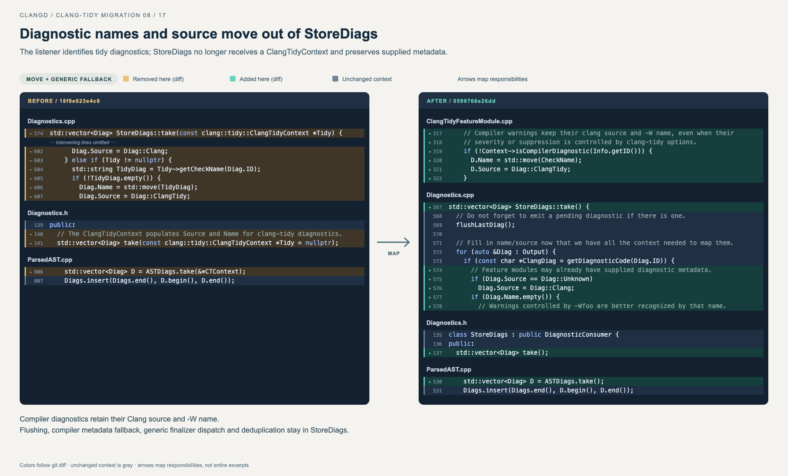

[Scalable image](assets/08-metadata.svg)

- Compiler diagnostics retain their Clang source and -W name.
- Flushing, compiler metadata fallback, generic finalizer dispatch and deduplication stay in StoreDiags.

### 9. Message cleanup and tidy-specific tags

**MOVE + SMALL GUARD.** Check-name suffix removal and tidy tag assignment move into finalizeDiagnostic(), once notes and fixes are available.

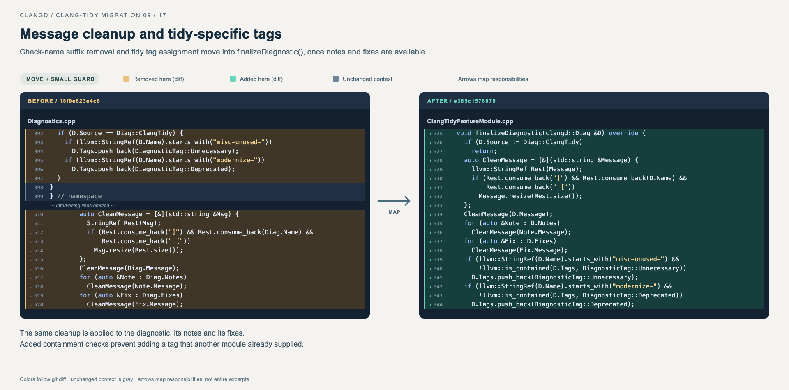

[Scalable image](assets/09-finalize.svg)

- The same cleanup is applied to the diagnostic, its notes and its fixes. Constructor errors get tidy metadata here because they precede check initialization.
- Added containment checks prevent adding a tag that another module already supplied.

### 10. Application wiring replaces the provider plumbing

**REWIRE.** ClangdMain explicitly creates the tidy module; server and ParseInputs use the existing generic FeatureModules pointer.

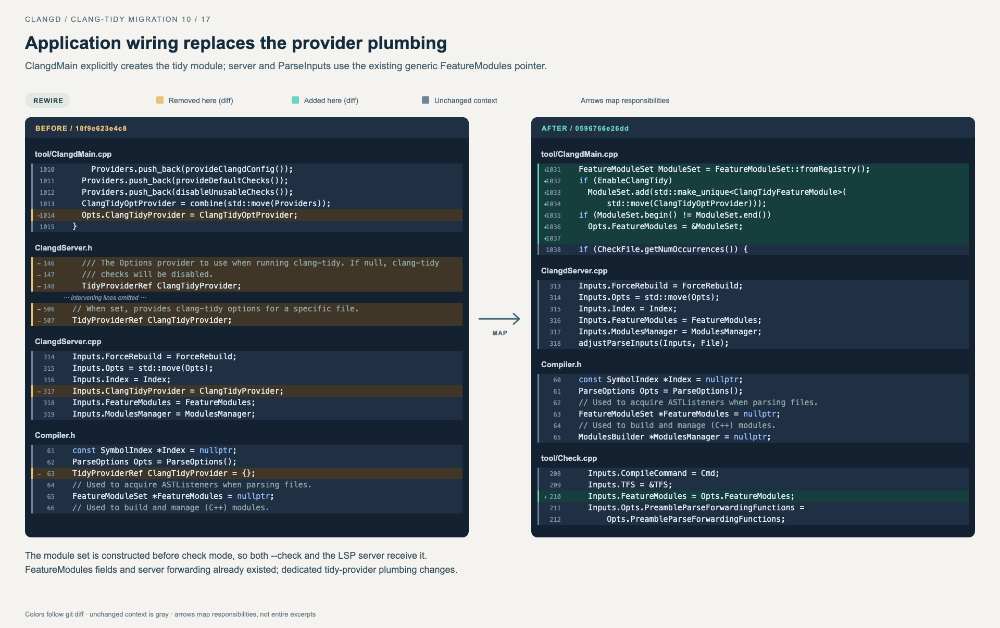

[Scalable image](assets/10-wiring.svg)

- The module set is constructed before check mode, so both --check and the LSP server receive it.
- FeatureModules fields and server forwarding already existed; dedicated tidy-provider plumbing changes.

### 11. Module-owned provider snapshots

**NEW OWNERSHIP.** A module owns the options provider. Each listener captures a shared snapshot, allowing later provider replacement.

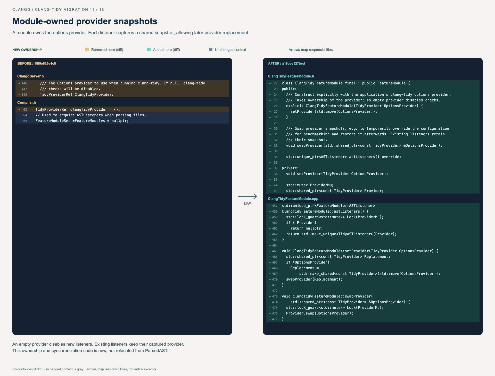

[Scalable image](assets/11-provider.svg)

- An empty provider disables new listeners. Existing listeners keep their captured provider.
- This ownership and synchronization code is new, not relocated from ParsedAST.

### 12. Check-mode timing swaps only tidy's provider

**REWIRE + NEW GUARD.** Benchmark runs replace the tidy provider temporarily, leaving the other feature modules in the build.

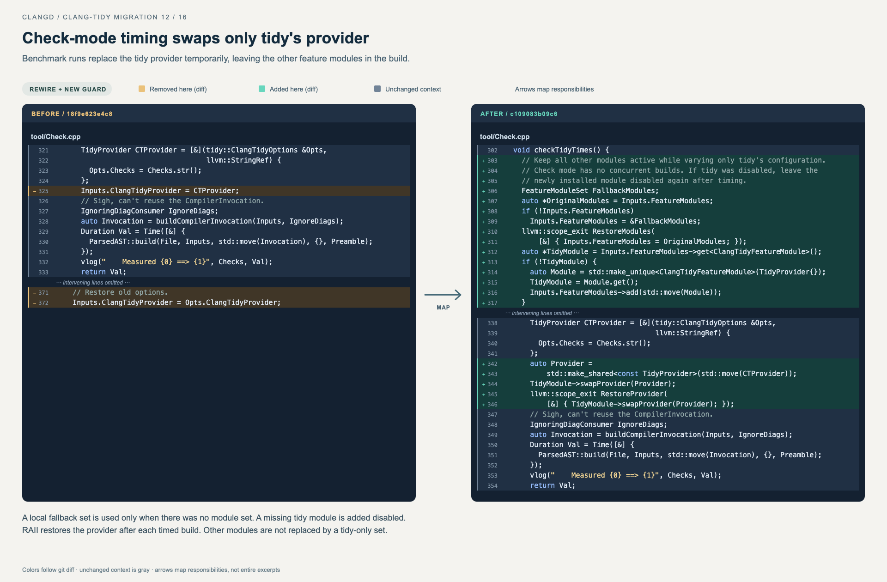

[Scalable image](assets/12-benchmark.svg)

- ClangdMain supplies the module for check mode; timing does not insert modules into a caller-owned set.
- RAII restores the provider after each timed build. Other modules are not replaced by a tidy-only set.

### 13. TestTU keeps the short test configuration

**TEST ADAPTER.** Tests may still assign TU.ClangTidyProvider. build() wraps it in a local module; inputs() only forwards explicit modules.

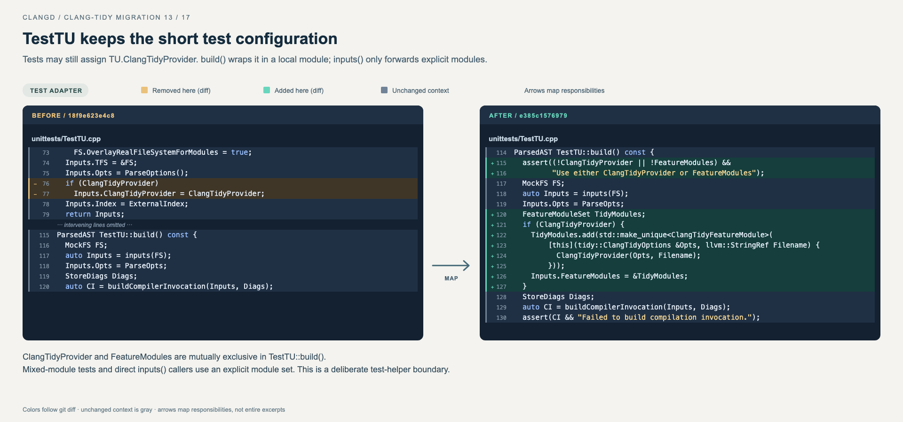

[Scalable image](assets/13-testtu.svg)

- ClangTidyProvider and FeatureModules are mutually exclusive in TestTU::build().
- Mixed-module tests and direct inputs() callers use an explicit module set. This is a deliberate test-helper boundary.
- TestTU.h is unchanged; only the build adapter in TestTU.cpp changes.

### 14. Server and LSP tests register a feature module

**TEST ADAPTER.** Tests embedding the server replace the removed options field with an explicitly constructed tidy module.

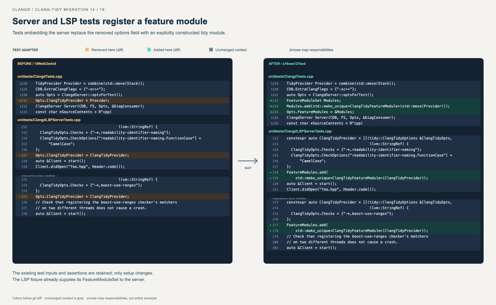

[Scalable image](assets/14-server-tests.svg)

- The existing test inputs and assertions are retained; only setup changes.
- The LSP fixture already supplies its FeatureModuleSet to the server.

### 15. IncludeFixer and orchestration stay in the core

**STAYS IN PLACE.** IncludeFixer stays in ParsedAST; colored lines show reindentation and rewrites within that same file.

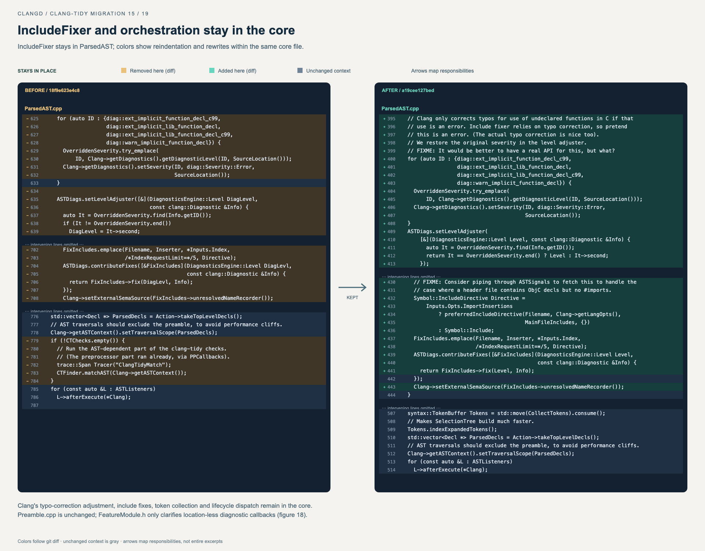

[Scalable image](assets/15-stays.svg)

- Clang's typo-correction severity adjustment and include fixes remain in ParsedAST.
- Preamble.cpp is unchanged; FeatureModule.h clarifies location-less error callbacks (figure 18).

### 16. Build integration and focused regression additions

**NEW SUPPORT.** CMake and GN compile the module. Six unit regressions and one lit test protect the migration.

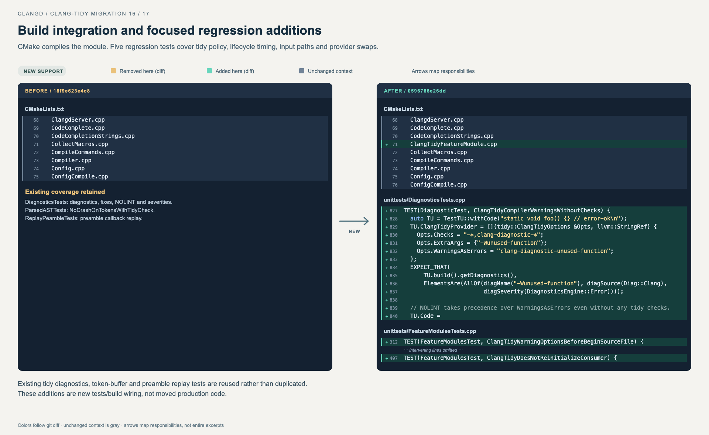

[Scalable image](assets/16-build-tests.svg)

- Existing tidy diagnostics, token-buffer and preamble replay tests are reused rather than duplicated.
- The relative-input and provider-swap tests are shown in full in figure 17.

### 17. Relative inputs and temporary provider overrides

**NEW TESTS.** Two module-specific regression tests cover filename resolution at the new listener boundary and temporary provider restoration.

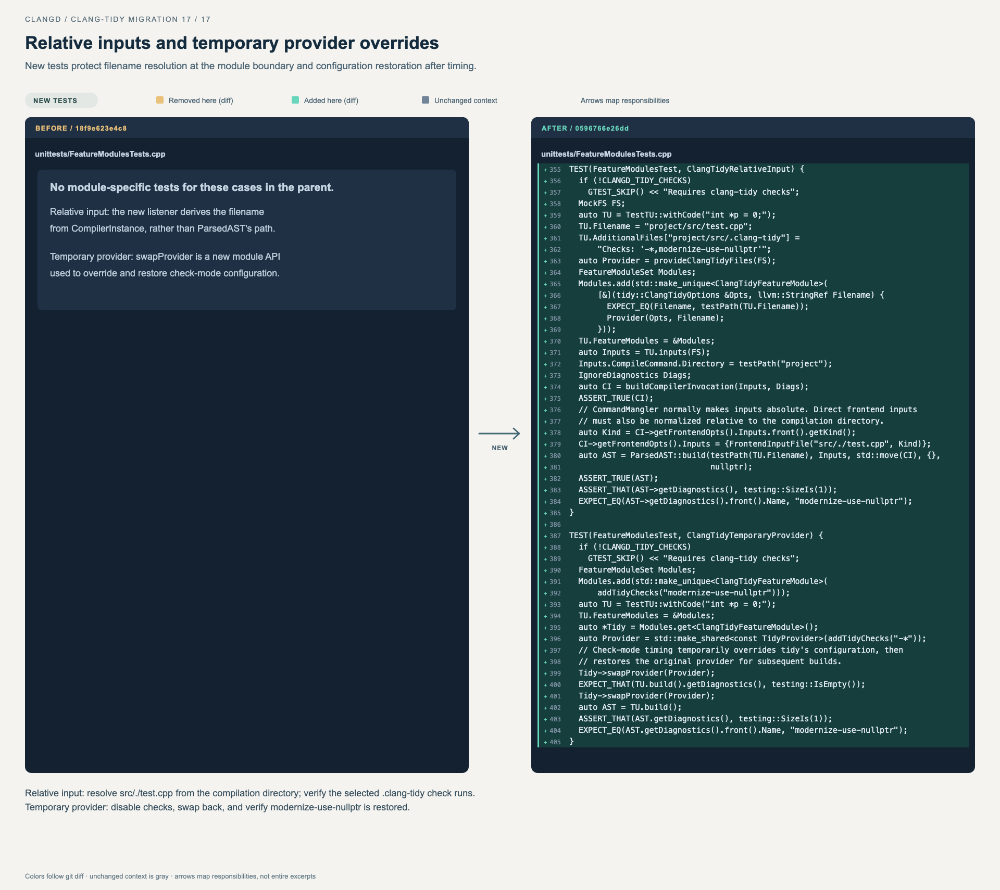

[Scalable image](assets/17-paths-provider.svg)

- ClangTidyRelativeInput supplies relative and differing frontend inputs, verifies that the provider receives clangd's original requested filename, and runs the check selected by that file's `.clang-tidy`.
- ClangTidyTemporaryProvider disables checks through swapProvider(), then swaps back and verifies that the original modernize-use-nullptr diagnostic returns.

### 18. Location-less errors and build/check-mode support

**GENERIC API + SUPPORT.** Retained errors without source locations now reach diagnostic listeners, enabling suppression after tidy initialization. Constructor errors preserve their previous suppression timing.

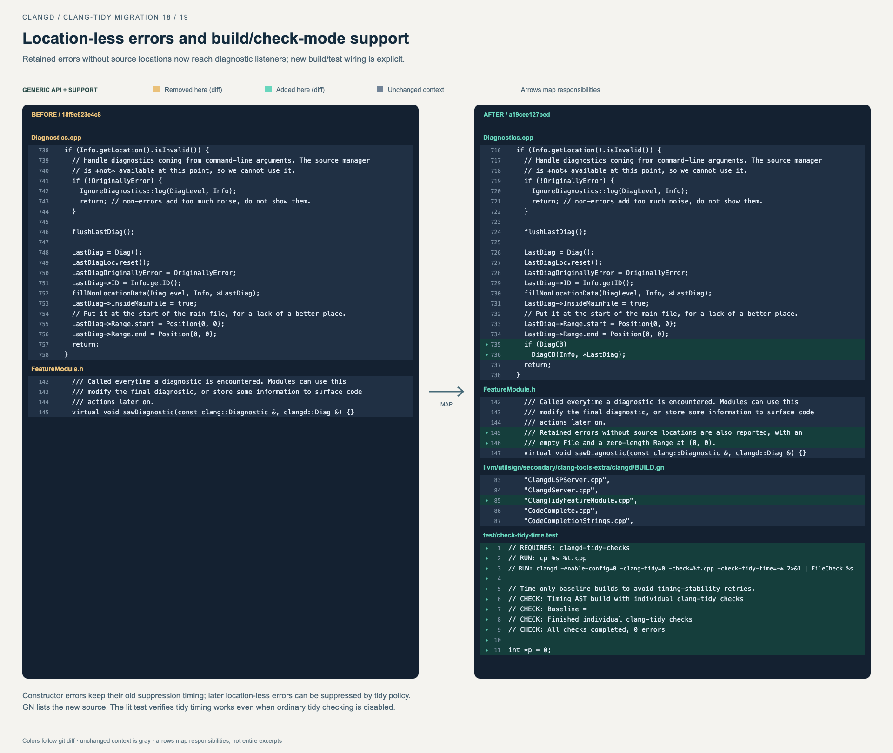

[Scalable image](assets/18-diagnostic-build.svg)

- The callback contract documents the empty file and placeholder range for these errors.
- GN lists the module source; the lit test verifies timing with ordinary tidy checking disabled.

### 19. Code moves together with its original comments

**CODE + COMMENTS.** Original explanatory comments and existing FIXMEs move together with the code. Their wording is retained; indentation and line wrapping may change. New comments explain the added adapters and wiring.

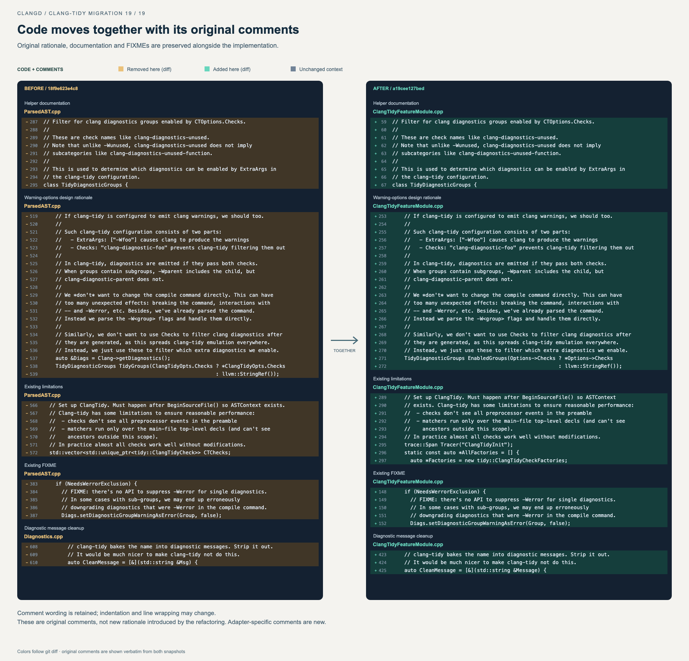

[Scalable image](assets/19-comments.svg)

The pairs show helper documentation, the warning-options rationale, existing limitations, a FIXME, and diagnostic cleanup. Their comment wording matches after ignoring whitespace and line wrapping.

## Coverage of all changed files

The figures group related changes; they are not a screenshot of every diff hunk. All 19 changed files are accounted for below. Include cleanup, comment edits, and full function bodies are available in [migration.patch](migration.patch).

| File (under clang-tools-extra/clangd/) | Change | Figure(s) |
| --- | --- | --- |
| [`CMakeLists.txt`](https://github.com/ArcsinX/llvm-project/blob/a19cee127beda88aa79dd0e7d18eb395a6eb4da7/clang-tools-extra/clangd/CMakeLists.txt) | Compile the new module | 16 |
| [`ClangTidyFeatureModule.cpp`](https://github.com/ArcsinX/llvm-project/blob/a19cee127beda88aa79dd0e7d18eb395a6eb4da7/clang-tools-extra/clangd/ClangTidyFeatureModule.cpp) | Relocated helpers/check lifecycle/diagnostic policy, plus adapters and provider snapshots | 1–12 |
| [`ClangTidyFeatureModule.h`](https://github.com/ArcsinX/llvm-project/blob/a19cee127beda88aa79dd0e7d18eb395a6eb4da7/clang-tools-extra/clangd/ClangTidyFeatureModule.h) | New explicit module API and provider ownership | 11 |
| [`ClangdServer.cpp`](https://github.com/ArcsinX/llvm-project/blob/a19cee127beda88aa79dd0e7d18eb395a6eb4da7/clang-tools-extra/clangd/ClangdServer.cpp) | Remove dedicated provider forwarding; retain generic module forwarding | 10 |
| [`ClangdServer.h`](https://github.com/ArcsinX/llvm-project/blob/a19cee127beda88aa79dd0e7d18eb395a6eb4da7/clang-tools-extra/clangd/ClangdServer.h) | Remove provider fields from options and server state | 10–11 |
| [`Compiler.h`](https://github.com/ArcsinX/llvm-project/blob/a19cee127beda88aa79dd0e7d18eb395a6eb4da7/clang-tools-extra/clangd/Compiler.h) | Remove tidy-specific ParseInputs field/include | 10–11 |
| [`Diagnostics.cpp`](https://github.com/ArcsinX/llvm-project/blob/a19cee127beda88aa79dd0e7d18eb395a6eb4da7/clang-tools-extra/clangd/Diagnostics.cpp) | Move tidy metadata/cleanup/tags; preserve module metadata; notify listeners of retained location-less errors | 8–9 |
| [`Diagnostics.h`](https://github.com/ArcsinX/llvm-project/blob/a19cee127beda88aa79dd0e7d18eb395a6eb4da7/clang-tools-extra/clangd/Diagnostics.h) | Remove ClangTidyContext dependency from take() | 8 |
| [`ParsedAST.cpp`](https://github.com/ArcsinX/llvm-project/blob/a19cee127beda88aa79dd0e7d18eb395a6eb4da7/clang-tools-extra/clangd/ParsedAST.cpp) | Extract tidy logic; keep frontend orchestration and IncludeFixer | 1–7, 15 |
| [`tool/Check.cpp`](https://github.com/ArcsinX/llvm-project/blob/a19cee127beda88aa79dd0e7d18eb395a6eb4da7/clang-tools-extra/clangd/tool/Check.cpp) | Forward modules and swap the tidy provider during timing | 10, 12 |
| [`tool/ClangdMain.cpp`](https://github.com/ArcsinX/llvm-project/blob/a19cee127beda88aa79dd0e7d18eb395a6eb4da7/clang-tools-extra/clangd/tool/ClangdMain.cpp) | Create the explicit tidy module before check/LSP dispatch | 10 |
| [`unittests/ClangdLSPServerTests.cpp`](https://github.com/ArcsinX/llvm-project/blob/a19cee127beda88aa79dd0e7d18eb395a6eb4da7/clang-tools-extra/clangd/unittests/ClangdLSPServerTests.cpp) | Two LSP tests add the tidy module to the fixture's set | 14 |
| [`unittests/ClangdTests.cpp`](https://github.com/ArcsinX/llvm-project/blob/a19cee127beda88aa79dd0e7d18eb395a6eb4da7/clang-tools-extra/clangd/unittests/ClangdTests.cpp) | Server test installs a tidy module | 14 |
| [`unittests/DiagnosticsTests.cpp`](https://github.com/ArcsinX/llvm-project/blob/a19cee127beda88aa79dd0e7d18eb395a6eb4da7/clang-tools-extra/clangd/unittests/DiagnosticsTests.cpp) | Preserve zero-check warning semantics; cover location-less tidy errors | 16 |
| [`unittests/FeatureModulesTests.cpp`](https://github.com/ArcsinX/llvm-project/blob/a19cee127beda88aa79dd0e7d18eb395a6eb4da7/clang-tools-extra/clangd/unittests/FeatureModulesTests.cpp) | Add warning-timing, consumer-initialization, relative-input and provider-swap regressions | 16–17 |
| [`unittests/TestTU.cpp`](https://github.com/ArcsinX/llvm-project/blob/a19cee127beda88aa79dd0e7d18eb395a6eb4da7/clang-tools-extra/clangd/unittests/TestTU.cpp) | Build-only local tidy module; direct inputs use explicit modules | 13 |

| [`FeatureModule.h`](https://github.com/ArcsinX/llvm-project/blob/a19cee127beda88aa79dd0e7d18eb395a6eb4da7/clang-tools-extra/clangd/FeatureModule.h) | Document retained location-less errors in sawDiagnostic | 18 |
| [`test/check-tidy-time.test`](https://github.com/ArcsinX/llvm-project/blob/a19cee127beda88aa79dd0e7d18eb395a6eb4da7/clang-tools-extra/clangd/test/check-tidy-time.test) | Verify --check-tidy-time with ordinary tidy checking disabled | 18 |
| [`llvm/utils/gn/secondary/clang-tools-extra/clangd/BUILD.gn`](https://github.com/ArcsinX/llvm-project/blob/a19cee127beda88aa79dd0e7d18eb395a6eb4da7/llvm/utils/gn/secondary/clang-tools-extra/clangd/BUILD.gn) | Compile the new module in GN | 18 |

Paths beginning with `llvm/` are repository-root-relative. Other file paths are relative to `clang-tools-extra/clangd/`.

## Sharing

Share this folder (or its ZIP) intact: `README.md` refers to `assets/*.png`. The [published site](https://arcsinx.github.io/clang-tidy-feature-module-walkthrough/) embeds the vector diagrams and links to exact source versions on GitHub. You can also download `index.html` for a standalone copy or the ZIP for the original Markdown and images.
